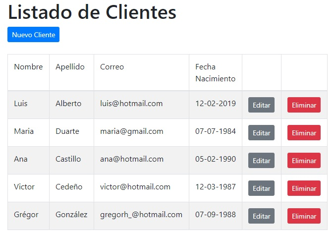

# Sistema de Control de Clientes
Examen realizado para HQ Rental Software por Grégor González

## Tecnologías Usadas

- Laravel 5.7
- Bootstrap 4
- Mysql (MariaDB 10)
- No se usó migraciones porque no se especificó, se incluye archivo sql con la bd

Pantalla de Ejemplo:
